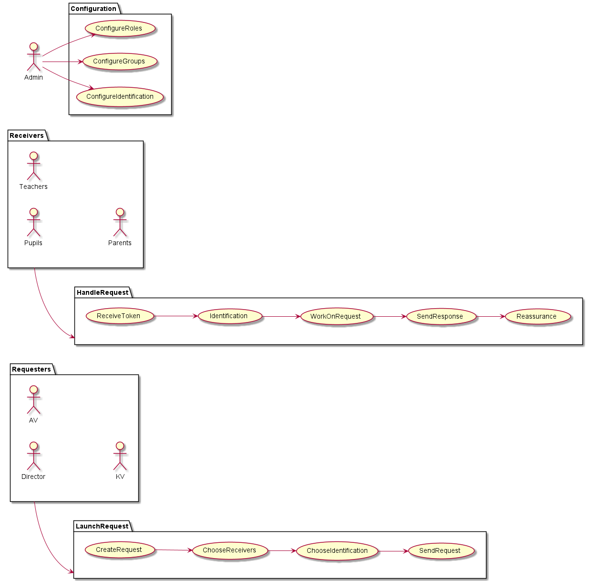

= Wahlfach-EntscheidungsTool

== Vertraulichkeitsstufen der relevanten Daten
* Öffentlich:
** Lehrer*innen: Name, Namenskürzel, Email, Sprechstunde.
* Intern:
** Lehrer*innen: Telefonnummer.
** Schüler*innen: Name, EMail, Geburtsdatum.
** Eltern: Name, EMail, Telefonnummer.
* Vertraulich:
** Schüler*innen: Noten.
* Geheim: alle Passwörter, Handy-Zugang.

== Use Case Diagram
[plantuml, png]
----

----

== Gesprächsnotizen
* 20.9. Klasse:
** Receiver erhält das von ihm ausgefüllte Formular per EMail als Bestätigung.
* 20.9. AV:
** CSV-basierte Ergebnisse (Excel-Möglichkeit).
** CreateRequest genauer überlegen - welche Auswahl-Möglichkeiten.
------------------
* Doodle nervt.
* stabil soll es sein.
* noch nichts vorhanden – grüne Wiese.
* Tech unsicher bzw. offen.
* Formular für Schüler*innen.
* Wählt: Matura Deutsch/Englisch schriftlich/mündlich, je nach Abteilung.
* Zum Einloggen vorhandene User Creds verwenden!?
* Keine Anforderung: Mitteilungsheft (soll über WebUntis kommen).
* Offen: Unterschrift / Verbindlichkeit. Vielleicht im Hintergrund über GIT; Hash mitnehmen, damit die Vergangenheit nicht geändert werden kann.
* weitere Use Cases: Anmeldung für Sommerschule oder ähnliches.
* konfigurierbar, flexibel, Formulare.
* Excel-Export (Reports).
* History, auch für Schüler*innen.
* Rollen: Requestor, Schüler*in.
* Addon: Request an Lehrer*innen.
* Eltern vermutlich schwierig (2 Factor Identification).
* Es gibt bereits (jeweils stand-alone): Lehrplanverwaltungstool, Semesterprüfungsanmeldetool.
* Single Sign-on wäre super (Keycloak, LDAP, token).
